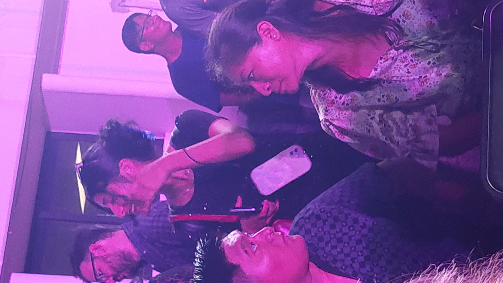

###### . . .

No hay palabras para describir lo maravillado que me has dejado.

Ya me esperaba verte en el escenario, me lo esperaba, era obvio, sin embargo... no estaba preparado para verte ahí arriba, tan maravillosa, tan elegante como solo tu puedes serlo, te viste espectacular, siempre lo estás, pero esta noche estabas como nunca. Ni siquiera las luces podían iluminar más el escenario que tu y tu sonrisa.

Mis palabras no representan ni un 1% de todo lo que sentí, tenía una sonrisa que no se podía ocultar, senti la necesidad de grabarte en todo momento, tomarte fotos y un impulso tremendo de correr a abrazarte.

No me puedo imaginar lo feliz que estuviste esta noche, debes sentirte nuy orgullosa de ti :smile:

Cuando el evento terminó, corrí a verte, casi olvido mi mochila, fuí a abrazarte y felicitarte con toda la alegría del mundo :heart:

No tienes ni idea de los nervios que sentí al ver a tu madre y hermano justo después de abrazarte.

Verdaderamente fue un día llena de emociones:smile::heart:

Ya para terminar, quiero que sepas que estaré contigo cada vez que me necesites.

Te quiero muchísimo Blanquita, por favor, no lo olvides:heart:

                R.C.C.